# Visualisasi data

## Diagram batang


```R
library(dplyr)
df <- read.csv('../data/murders.csv')
head(df)
```

    
    Attaching package: ‘dplyr’
    
    The following objects are masked from ‘package:stats’:
    
        filter, lag
    
    The following objects are masked from ‘package:base’:
    
        intersect, setdiff, setequal, union
    


<table>
<thead><tr><th scope=col>state</th><th scope=col>abb</th><th scope=col>region</th><th scope=col>population</th><th scope=col>PopulationDensity</th><th scope=col>murders</th><th scope=col>gunmurders</th><th scope=col>gunownership</th></tr></thead>
<tbody>
	<tr><td>Alabama    </td><td>AL         </td><td>South      </td><td> 4779736   </td><td> 94.65     </td><td> 199       </td><td> 135       </td><td>0.517      </td></tr>
	<tr><td>Arizona    </td><td>AZ         </td><td>West       </td><td> 6392017   </td><td> 57.05     </td><td> 352       </td><td> 232       </td><td>0.311      </td></tr>
	<tr><td>California </td><td>CA         </td><td>West       </td><td>37253956   </td><td>244.20     </td><td>1811       </td><td>1257       </td><td>0.213      </td></tr>
	<tr><td>Colorado   </td><td>CO         </td><td>West       </td><td> 5029196   </td><td> 49.33     </td><td> 117       </td><td>  65       </td><td>0.347      </td></tr>
	<tr><td>Connecticut</td><td>CT         </td><td>Northeast  </td><td> 3574097   </td><td>741.40     </td><td> 131       </td><td>  97       </td><td>0.167      </td></tr>
	<tr><td>Florida    </td><td>FL         </td><td>South      </td><td>19687653   </td><td>360.20     </td><td> 987       </td><td> 669       </td><td>0.245      </td></tr>
</tbody>
</table>


```R
subdf <- select(df, state, population, murders)
head(subdf)
```


<table>
<thead><tr><th scope=col>state</th><th scope=col>population</th><th scope=col>murders</th></tr></thead>
<tbody>
	<tr><td>Alabama    </td><td> 4779736   </td><td> 199       </td></tr>
	<tr><td>Arizona    </td><td> 6392017   </td><td> 352       </td></tr>
	<tr><td>California </td><td>37253956   </td><td>1811       </td></tr>
	<tr><td>Colorado   </td><td> 5029196   </td><td> 117       </td></tr>
	<tr><td>Connecticut</td><td> 3574097   </td><td> 131       </td></tr>
	<tr><td>Florida    </td><td>19687653   </td><td> 987       </td></tr>
</tbody>
</table>


```R
barplot(subdf$population)
```


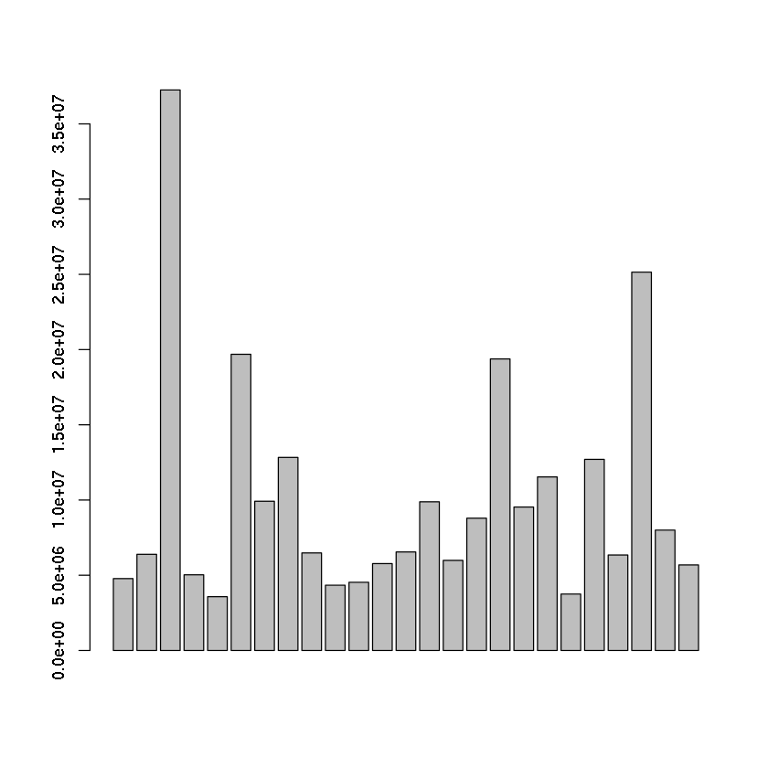


```R
# kostumisasi grafik
barplot(subdf$population,
       xlab='states',
       ylab='population',
       main='State vs Population',
       names.arg = subdf$state,
       col='blue')
```


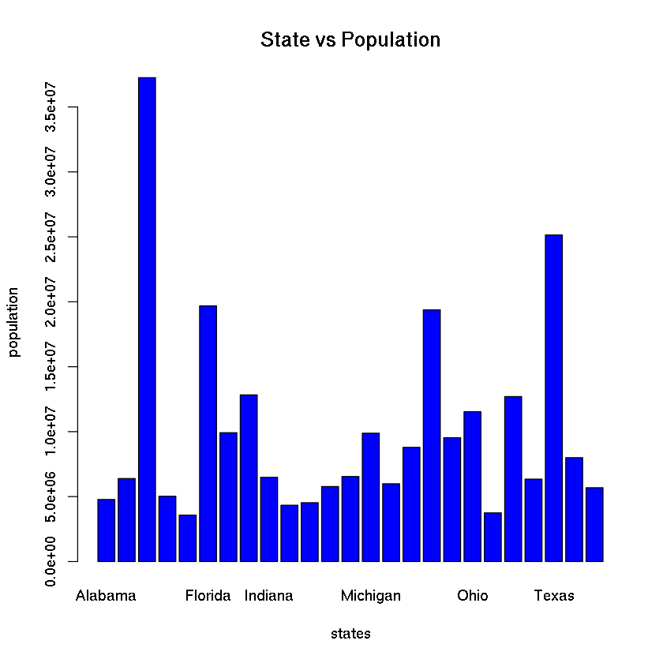


```R
# kostumisasi grafik murders
barplot(subdf$murders,
       xlab='murders',
       ylab='population',
       main='State vs Murders',
       names.arg = subdf$state,
       col='blue')
```


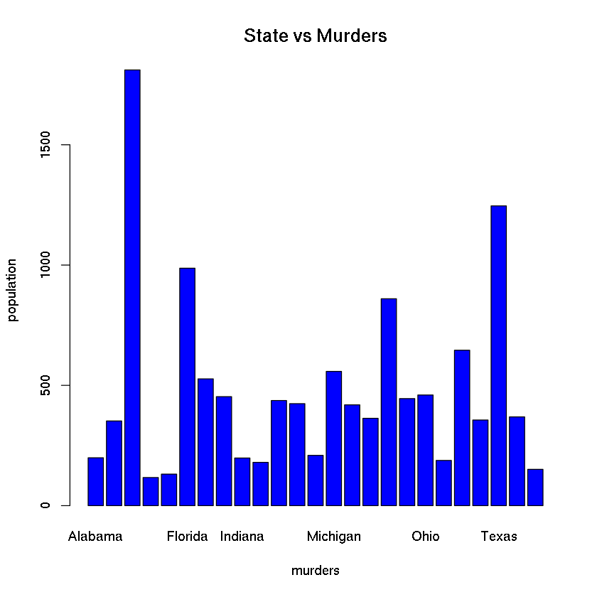


```R
# mengurutkan df berdasarkan angka pembunuhan (secara terbalik)
dfsort <- arrange(df, desc(murders)) 

# menseleksi kolom - kolom tertentu
subdfsort <- select(dfsort, state, population, murders)

# Mengambil 5 data tertinggi untuk kasus pembunuhan
topsubdfsort <- head(subdfsort,5)

# PLOT!!!
barplot(topsubdfsort$murders,
       xlab='murders',
       ylab='population',
       main='State vs Murders',
       names.arg = topsubdfsort$state,
       col='blue')
```


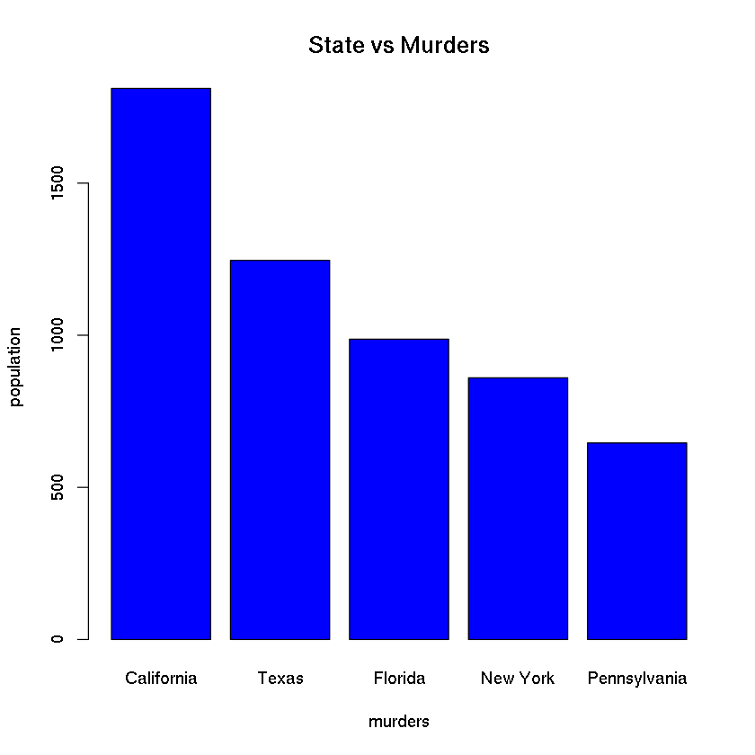


## Diagram batang horizontal


```R
df <- read.csv("../data/murdersmini.csv")
df
```


<table>
<thead><tr><th scope=col>state</th><th scope=col>population</th><th scope=col>murders</th></tr></thead>
<tbody>
	<tr><td>Arizona   </td><td> 6392017  </td><td> 352      </td></tr>
	<tr><td>Colorado  </td><td> 5029196  </td><td> 117      </td></tr>
	<tr><td>Georgia   </td><td> 9920000  </td><td> 527      </td></tr>
	<tr><td>Iowa      </td><td> 3046355  </td><td>  38      </td></tr>
	<tr><td>Kansas    </td><td> 2853118  </td><td> 100      </td></tr>
	<tr><td>Maine     </td><td> 1328361  </td><td>  24      </td></tr>
	<tr><td>Michigan  </td><td> 9883640  </td><td> 558      </td></tr>
	<tr><td>New York  </td><td>19378102  </td><td> 860      </td></tr>
	<tr><td>Texas     </td><td>25145561  </td><td>1246      </td></tr>
	<tr><td>Washington</td><td> 6724540  </td><td> 151      </td></tr>
</tbody>
</table>


```R
seldf <- select(df, state, murders)
barplot(seldf$murders, horiz=T,
       xlab='Murders', ylab='States',
       main = 'States vs Murders',
       col='blue',
       names.arg = seldf$state)
```


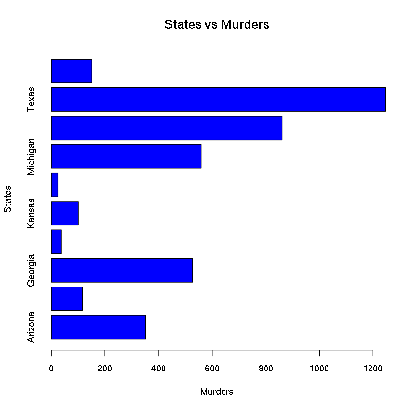


## Diagram batang bertumpuk


```R
df
```


<table>
<thead><tr><th scope=col>state</th><th scope=col>population</th><th scope=col>murders</th></tr></thead>
<tbody>
	<tr><td>Arizona   </td><td> 6392017  </td><td> 352      </td></tr>
	<tr><td>Colorado  </td><td> 5029196  </td><td> 117      </td></tr>
	<tr><td>Georgia   </td><td> 9920000  </td><td> 527      </td></tr>
	<tr><td>Iowa      </td><td> 3046355  </td><td>  38      </td></tr>
	<tr><td>Kansas    </td><td> 2853118  </td><td> 100      </td></tr>
	<tr><td>Maine     </td><td> 1328361  </td><td>  24      </td></tr>
	<tr><td>Michigan  </td><td> 9883640  </td><td> 558      </td></tr>
	<tr><td>New York  </td><td>19378102  </td><td> 860      </td></tr>
	<tr><td>Texas     </td><td>25145561  </td><td>1246      </td></tr>
	<tr><td>Washington</td><td> 6724540  </td><td> 151      </td></tr>
</tbody>
</table>


```R
dfs <- mutate(df,pop = population / 10000)
```


```R
names(dfs)
```


<ol class=list-inline>
	<li>'state'</li>
	<li>'population'</li>
	<li>'murders'</li>
	<li>'pop'</li>
</ol>


```R
dfs <- dfs[c(1,3,4)]
barplot(dfs$pop)
```


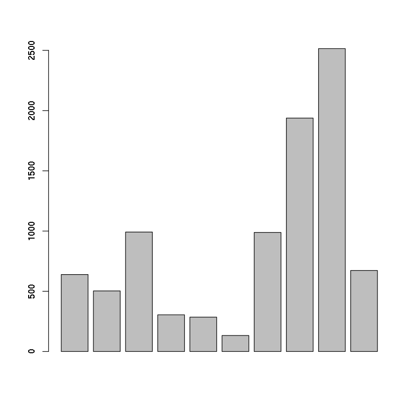


```R
barplot(dfs$murders)
```


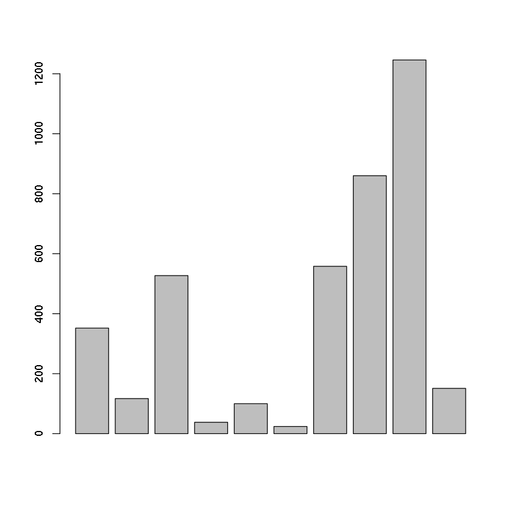


```R
mat <- data.matrix(dfs)
mat <- t(mat) # transpos
mat
```


<table>
<tbody>
	<tr><th scope=row>state</th><td>  1.0000</td><td>  2.0000</td><td>  3     </td><td>  4.0000</td><td>  5.0000</td><td>  6.0000</td><td>  7.000 </td><td>   8.00 </td><td>   9.000</td><td> 10.000 </td></tr>
	<tr><th scope=row>murders</th><td>352.0000</td><td>117.0000</td><td>527     </td><td> 38.0000</td><td>100.0000</td><td> 24.0000</td><td>558.000 </td><td> 860.00 </td><td>1246.000</td><td>151.000 </td></tr>
	<tr><th scope=row>pop</th><td>639.2017</td><td>502.9196</td><td>992     </td><td>304.6355</td><td>285.3118</td><td>132.8361</td><td>988.364 </td><td>1937.81 </td><td>2514.556</td><td>672.454 </td></tr>
</tbody>
</table>


```R
barplot(mat, 
       xlab='States',
       main='Population vs Murders',
       col=c('blue', 'red'),
       names.arg=dfs$state)
legend('topleft', c('Population', 'Murders'), fill=c('blue', 'red'))
```


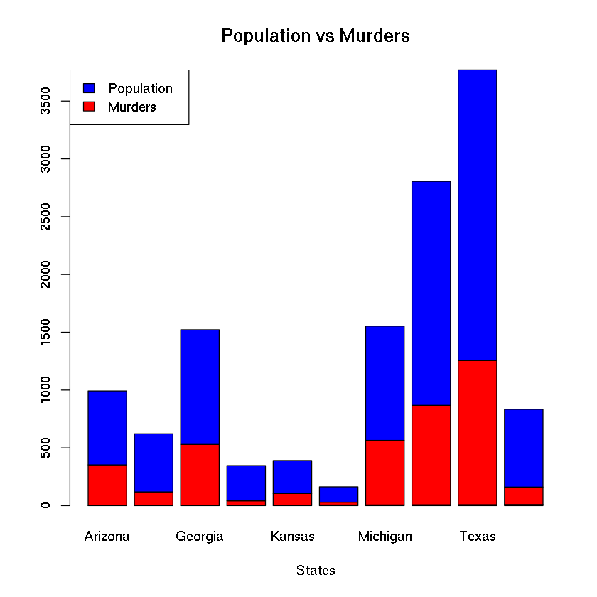


## Histogram


```R
df <- read.csv('../data/GEStock.csv')
head(df)
```


<table>
<thead><tr><th scope=col>Date</th><th scope=col>Price</th></tr></thead>
<tbody>
	<tr><td>1/1/70  </td><td>74.25333</td></tr>
	<tr><td>2/1/70  </td><td>69.97684</td></tr>
	<tr><td>3/1/70  </td><td>72.15857</td></tr>
	<tr><td>4/1/70  </td><td>74.25273</td></tr>
	<tr><td>5/1/70  </td><td>66.66524</td></tr>
	<tr><td>6/1/70  </td><td>67.59318</td></tr>
</tbody>
</table>


```R
subdf <- select(df, Date, Price)
```


```R
hist(subdf$Price,
    xlab='Stock Price',
    main='',
    col='#afe3be',
    border='red',
    breaks = 20) # secara default bins=10
```


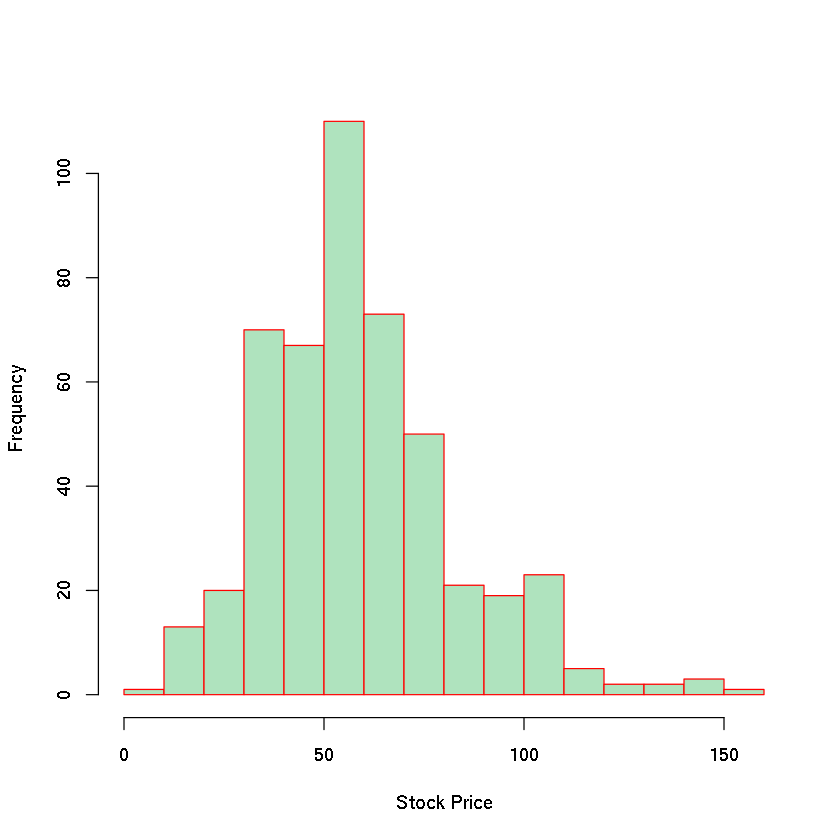


## *Scatterplot*


```R
df <- read.csv("../data/murders.csv")
df <- select(df,state,population,murders)
```


```R
plot(df$population, df$murders,
    xlab='Population', ylab='Murders',
    main='Population vs Murders', col='red',
    pch = 20)
```


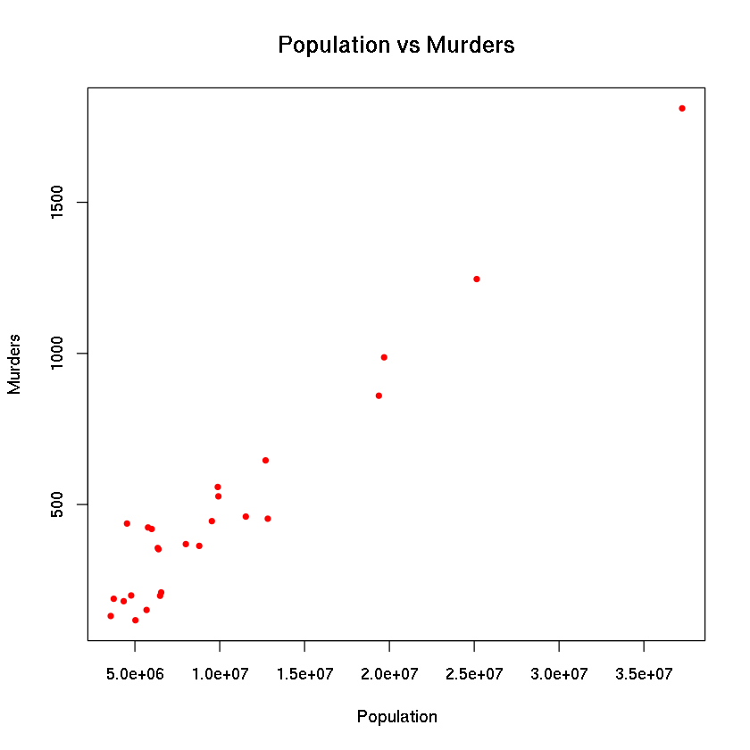


## Diagram garis


```R
plot(df$murders,type='l', 
    xlab='States', ylab='Murders',
    main='States vs Murders',
    col='blue')
```


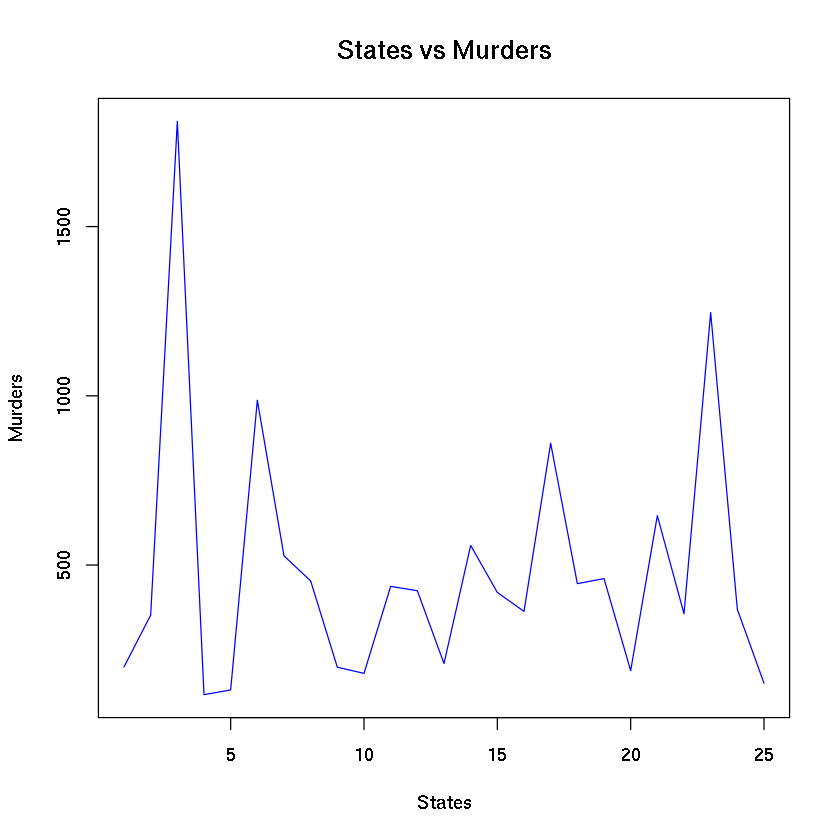


## *Boxplot*


```R
df <- read.csv('../data/murders.csv')
df <- select(df, state, population,murders, region)
```


```R
boxplot(df$murders ~ df$region,
       xlab='Region', ylab='Murders',
       main='Region vs Murders',
       col='red', border='blue',
       notch=T) # dipisahkan berdasarkan region
```

    Warning message in bxp(list(stats = structure(c(151, 198, 436, 460, 558, 131, 209, :
    “some notches went outside hinges ('box'): maybe set notch=FALSE”


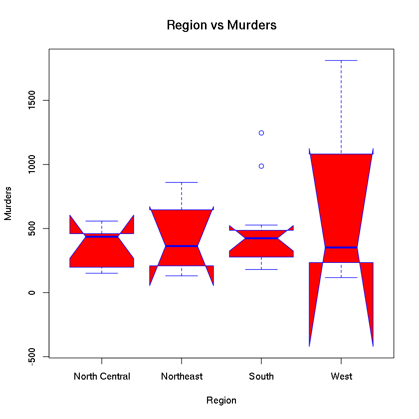


## Kombinasi plot


```R
df <- read.csv("../data/murdersmini.csv")
df <- mutate(df, pop = population/10000)
df <- df[c(1,3,4)] # seleksi kolom 1, 3, dan 4
```


```R
barplot(df$pop, xlab='States', ylab='Population', 
        main='State vs Population', col='blue', names.arg=df$state)
```


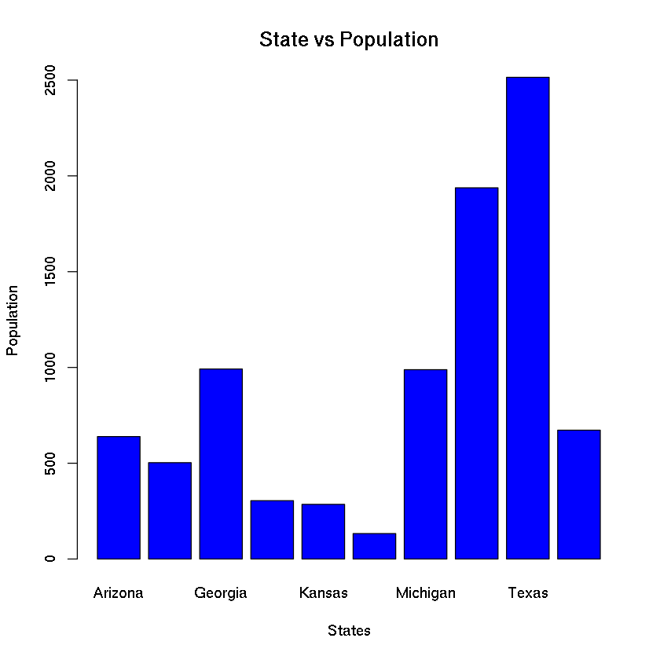


```R
barplot(df$murders, xlab='States', ylab='Murders',
        main='State vs Murders', col='blue', 
       names.arg=df$state)
```


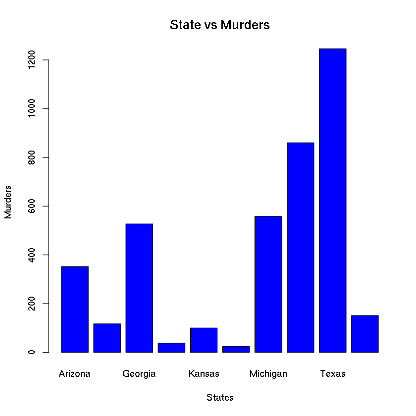


```R
# Supaya tidak jadi dua plot:
par(mfrow=c(2,2)) # 2 baris, 2 kolom
barplot(df$pop, xlab='States', ylab='Population', 
        main='State vs Population', col='blue', names.arg=df$state)
barplot(df$pop, xlab='States', ylab='Population', 
        main='State vs Population', col='blue', names.arg=df$state)
plot(df$pop, df$murders, xlab='Population', ylab='Murders', 
     col='red',pch=20, main='Population vs Murders')
```


