# Data kualitatif dan kuantitatif

## Pendahuluan

* Di R, data umumnya disimpan dalam bentuk vektor atau data frame.
* Data kualitatif, di dalam statistika dikenal sebagai data kategorikal.
* Data kualitatif dapat disimpan dalam bentuk *Factors*.
* Data kuantitatif, di dalam statistika dikenal sebagai data kontinyu atau data numerik.
* Data kuantitatif dapat disimpan dalam bentuk *Numeric*.

## Data kualitatif

Data kualitatif merupakan data non-statistik yang umumnya bersifat tidak terstruktur atau semi-terstruktur.
<br><br>
* Data kualitatif tidak melulu berasal dari pengukuran.
* Data kualitatif dikategorikan berdasarkan sifat - sifat, atribut, label, dll.
* Data ini digunakan untuk interpretasi dan pembuatan hipotesis.
* Data ini tidak dapat dikumpulkan dan dianalisa menggunakan metode - metode konvensional.
<br><br>
Contoh - contoh data kualitatif:
* Jenis kelamin,
* Ukuran sepatu,
* *Rating*.


```R
ukuranBaju <- c('S', 'M', 'L', 'XL', 
               'XXL', 'M', 'L', 'XL',
               'XXL', 'S', 'M')
ukuranBaju
```


<ol class=list-inline>
	<li>'S'</li>
	<li>'M'</li>
	<li>'L'</li>
	<li>'XL'</li>
	<li>'XXL'</li>
	<li>'M'</li>
	<li>'L'</li>
	<li>'XL'</li>
	<li>'XXL'</li>
	<li>'S'</li>
	<li>'M'</li>
</ol>


```R
ukuran_baju <- factor(ukuranBaju) # dijadikan dalam bentuk Factor
ukuran_baju
```


<ol class=list-inline>
	<li>S</li>
	<li>M</li>
	<li>L</li>
	<li>XL</li>
	<li>XXL</li>
	<li>M</li>
	<li>L</li>
	<li>XL</li>
	<li>XXL</li>
	<li>S</li>
	<li>M</li>
</ol>

<details>
	<summary style=display:list-item;cursor:pointer>
		<strong>Levels</strong>:
	</summary>
	<ol class=list-inline>
		<li>'L'</li>
		<li>'M'</li>
		<li>'S'</li>
		<li>'XL'</li>
		<li>'XXL'</li>
	</ol>
</details>


```R
str(ukuran_baju)
```

     Factor w/ 5 levels "L","M","S","XL",..: 3 2 1 4 5 2 1 4 5 3 ...


```R
summary(ukuran_baju)
```


<dl class=dl-horizontal>
	<dt>L</dt>
		<dd>2</dd>
	<dt>M</dt>
		<dd>3</dd>
	<dt>S</dt>
		<dd>2</dd>
	<dt>XL</dt>
		<dd>2</dd>
	<dt>XXL</dt>
		<dd>2</dd>
</dl>


```R
levels(ukuranBaju)
```


    NULL


```R
levels(ukuran_baju)
```


<ol class=list-inline>
	<li>'L'</li>
	<li>'M'</li>
	<li>'S'</li>
	<li>'XL'</li>
	<li>'XXL'</li>
</ol>


## Visualisasi data kualitatif

Gunakan:<br>
* Diagram batang,
* Diagram lingkaran.


```R
ukuran_baju
```


<ol class=list-inline>
	<li>S</li>
	<li>M</li>
	<li>L</li>
	<li>XL</li>
	<li>XXL</li>
	<li>M</li>
	<li>L</li>
	<li>XL</li>
	<li>XXL</li>
	<li>S</li>
	<li>M</li>
</ol>

<details>
	<summary style=display:list-item;cursor:pointer>
		<strong>Levels</strong>:
	</summary>
	<ol class=list-inline>
		<li>'L'</li>
		<li>'M'</li>
		<li>'S'</li>
		<li>'XL'</li>
		<li>'XXL'</li>
	</ol>
</details>


```R
tabelUkuranBaju <- table(ukuran_baju)
tabelUkuranBaju
```


    ukuran_baju
      L   M   S  XL XXL 
      2   3   2   2   2 


```R
barplot(tabelUkuranBaju)
```


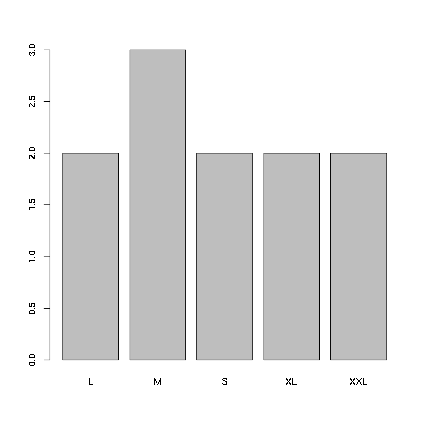


```R
# kostumisasi diagram batang
barplot(tabelUkuranBaju,
       col = c('blue', 'green', 'red', 'yellow','black'),
       ylab = 'Jumlah')
```


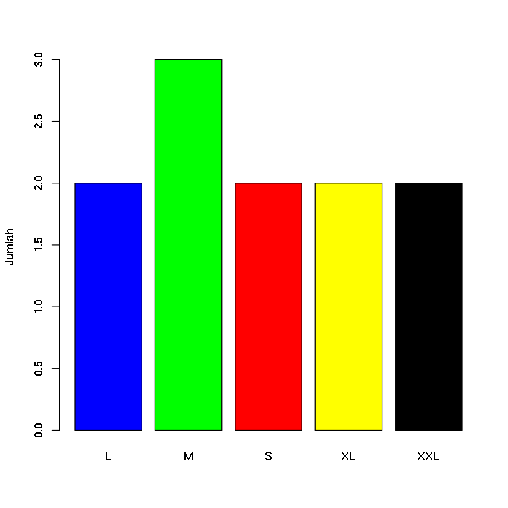


```R
# misalkan kita hanya ingin ukuran M
ukuran_baju == 'M'
```


<ol class=list-inline>
	<li>FALSE</li>
	<li>TRUE</li>
	<li>FALSE</li>
	<li>FALSE</li>
	<li>FALSE</li>
	<li>TRUE</li>
	<li>FALSE</li>
	<li>FALSE</li>
	<li>FALSE</li>
	<li>FALSE</li>
	<li>TRUE</li>
</ol>


```R
jmlh_ukuranM = sum(ukuran_baju == 'M')
jmlh_ukuranM
```


3


```R
# Penggunaan diagram lingkaran
pie(tabelUkuranBaju)
```


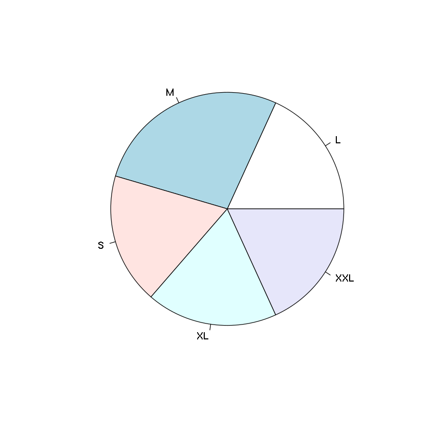


```R
# kostumisasi diagram lingkaran
pie(tabelUkuranBaju, col = c('blue', 'green', 'red', 'yellow','black'))
```


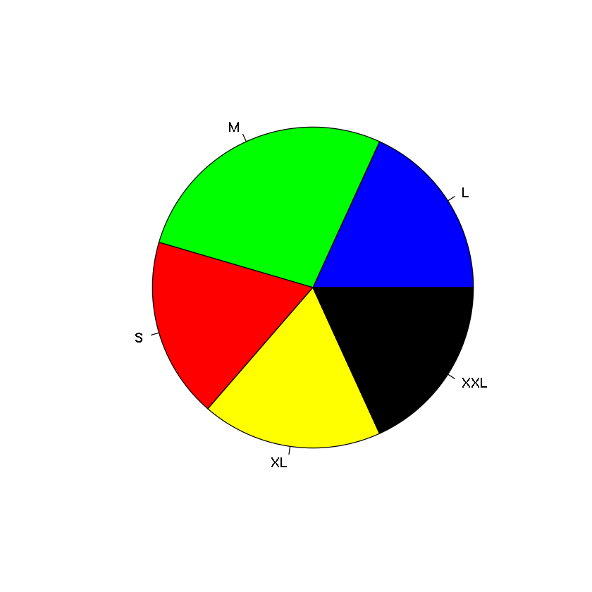


```R
kategori_usia <- factor(c(2,4,3,3,2,1,1,1,2,1,1,4,3,4,2,2,2,1,4,4,4,4,3,2,2,1))
```


```R
levels(kategori_usia)
```


<ol class=list-inline>
	<li>'1'</li>
	<li>'2'</li>
	<li>'3'</li>
	<li>'4'</li>
</ol>


```R
# mengubah level kategori usia
levels(kategori_usia) <- c('< 14', '15 - 24', '25 - 34', '> 35')
```


```R
tabelKategoriUsia <- table(kategori_usia)
tabelKategoriUsia
```


    kategori_usia
       < 14 15 - 24 25 - 34    > 35 
          7       8       4       7 


```R
barplot(tabelKategoriUsia,
       col=c('blue', 'red', 'green', 'yellow'),
       ylab = 'Jumlah')
```


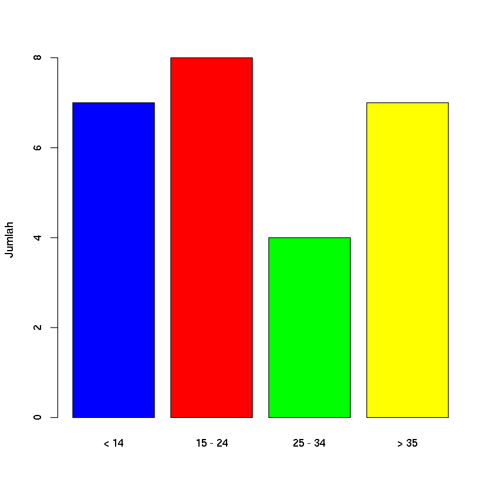


```R
pie(tabelKategoriUsia, col=c('blue', 'red', 'green', 'yellow'))
```


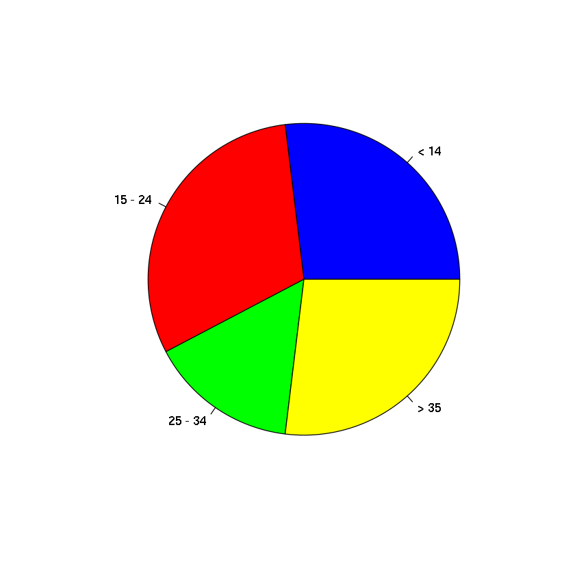


## Data kuantitatif

* Data kuantitatif dapat dihitung, diukur, dan diekspresikan secara numerik.
* Data kualitatif sendiri bersifat deskriptif dan konseptual.
* Data kuantitatif bersifat terstruktur.
<br><br>
Contoh:
* Pengukuran temperatur udara,
* Harga saham, dll.


```R
# panjang lagu (dalam menit)
lagu <- c(5.3,3.6,5.5,4.7,6.7,4.3,6.2,4.3,4.9,5.1,5.8,4.4) 
lagu
```


<ol class=list-inline>
	<li>5.3</li>
	<li>3.6</li>
	<li>5.5</li>
	<li>4.7</li>
	<li>6.7</li>
	<li>4.3</li>
	<li>6.2</li>
	<li>4.3</li>
	<li>4.9</li>
	<li>5.1</li>
	<li>5.8</li>
	<li>4.4</li>
</ol>


```R

```

## Visualisasi data kuantitatif

* Histogram
* *Boxplot*
* *strip-chart* $\rightarrow$ alternatif *boxplot* ketika ukuran sampel kecil.

### Histogram


```R
length(lagu) # jumlah elemen di dalam vektor lagu
```


12


```R
summary(lagu)
```


       Min. 1st Qu.  Median    Mean 3rd Qu.    Max. 
      3.600   4.375   5.000   5.067   5.575   6.700 


```R
hist(lagu)
```


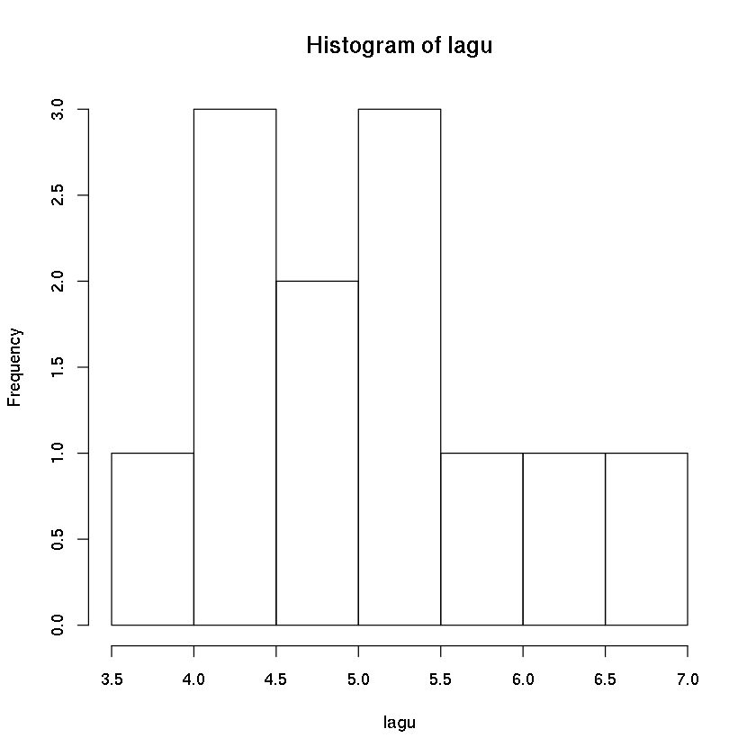


```R
hist(lagu, col='blue', prob=T) # pdf: probability density function
```


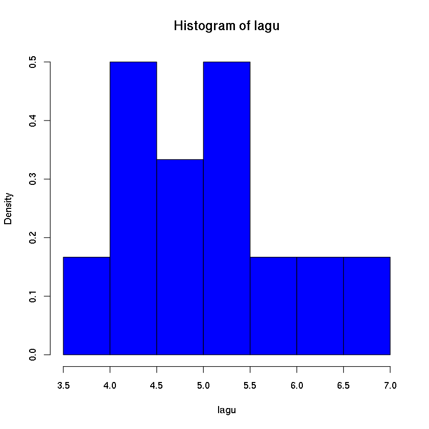


```R
hist(lagu, col='grey', prob=T)
lines(density(lagu), col='red')
```


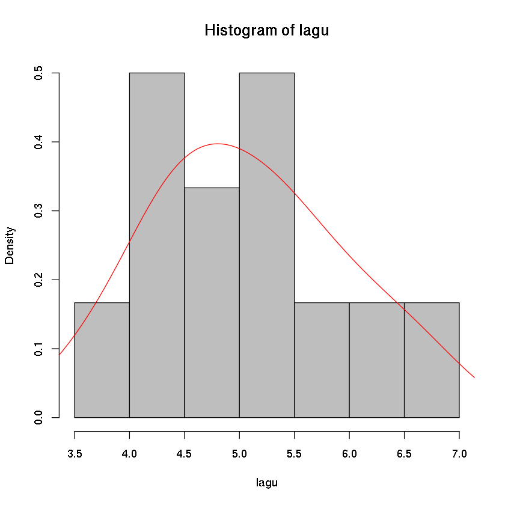


### *boxplot*


```R
boxplot(lagu)
```


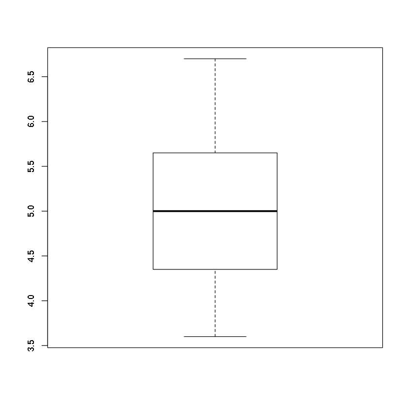


### *strip-chart*


```R
stripchart(lagu,col='red', pch=15, method='stack')
```


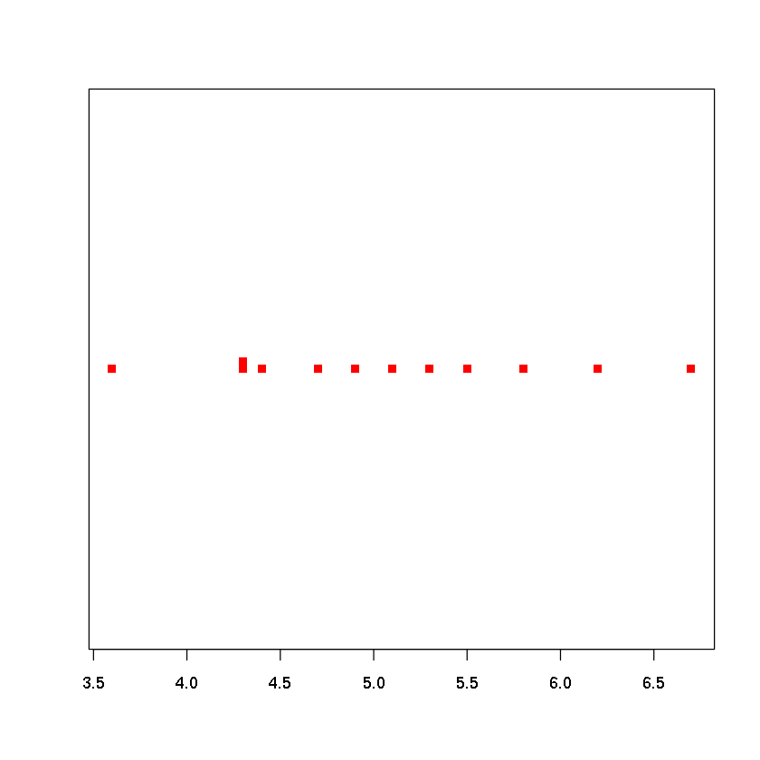


## Visualisasi data saham


```R
library(dplyr)
```

    
    Attaching package: ‘dplyr’
    
    The following objects are masked from ‘package:stats’:
    
        filter, lag
    
    The following objects are masked from ‘package:base’:
    
        intersect, setdiff, setequal, union
    


```R
gedata <- read.csv("../data/GEStock.csv")
```


```R
geharga <- select(gedata, Price)
```


```R
summary(geharga)
```


         Price        
     Min.   :  9.294  
     1st Qu.: 44.214  
     Median : 55.812  
     Mean   : 59.303  
     3rd Qu.: 72.226  
     Max.   :156.844  


```R
hist(as.vector(geharga$Price))
```


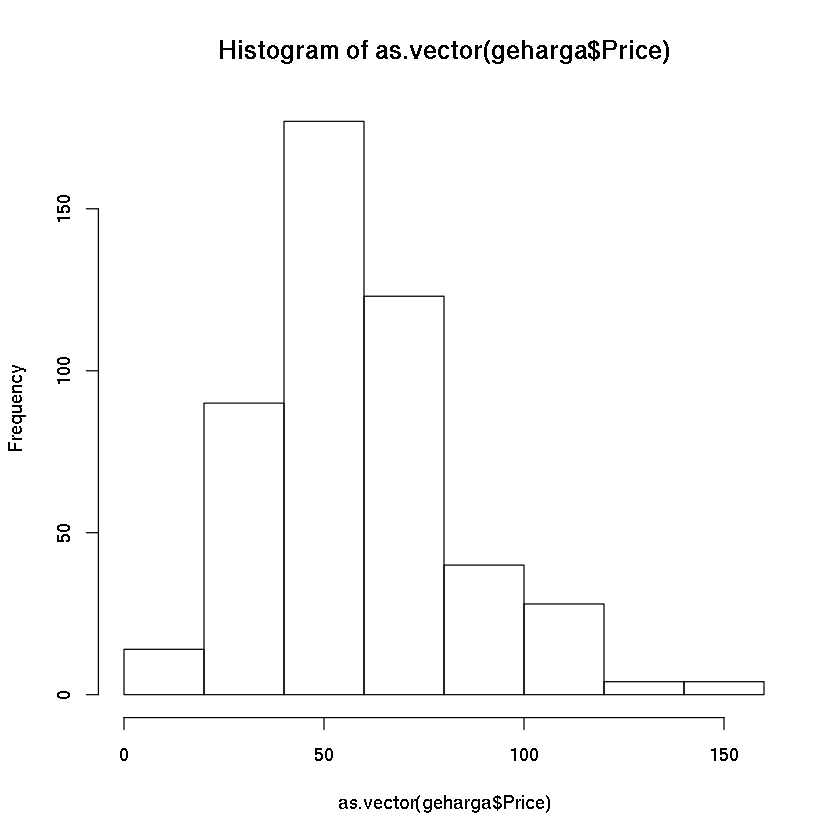


```R
hist(as.vector(geharga$Price), prob=T)
```


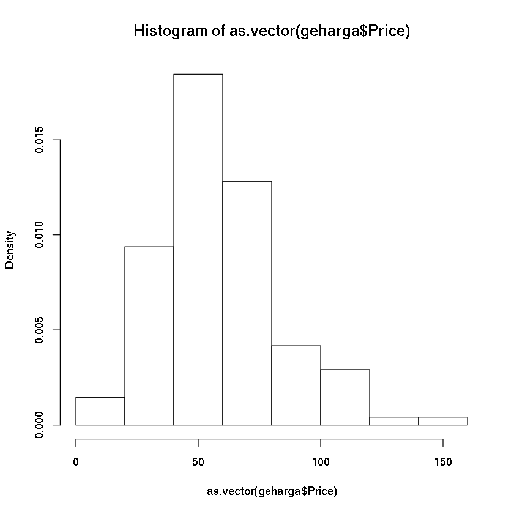


```R
hist(as.vector(geharga$Price), prob=T, col='blue')
```


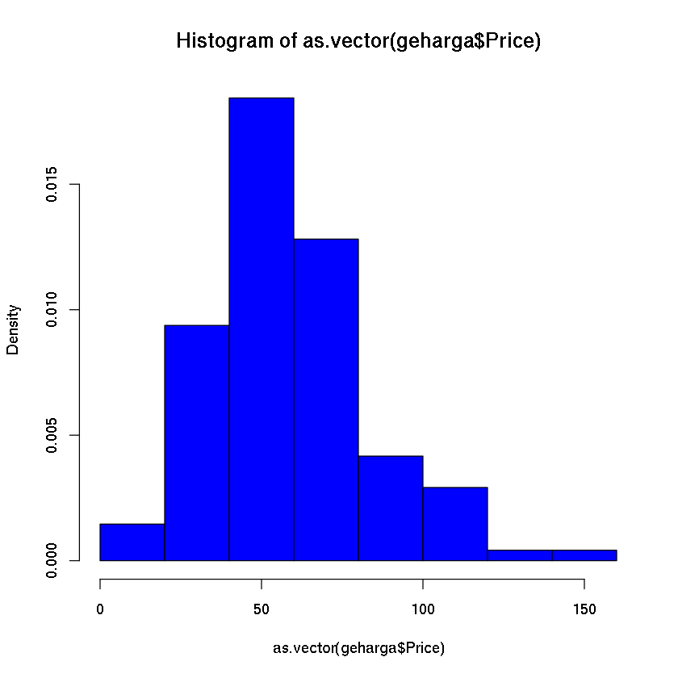


```R
hist(as.vector(geharga$Price), prob=T, col='blue', ylim=c(0,0.025))
lines(density(geharga$Price), col='red')
```


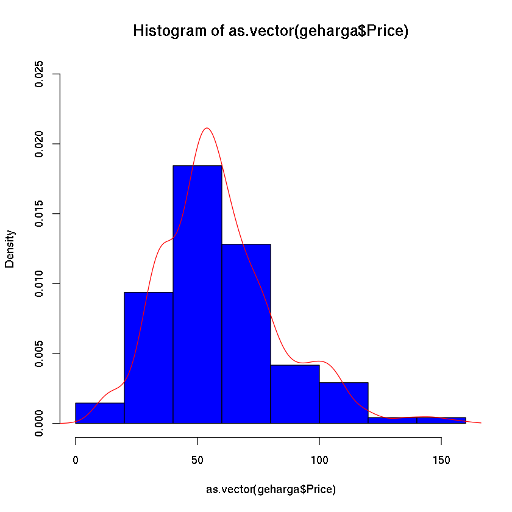

