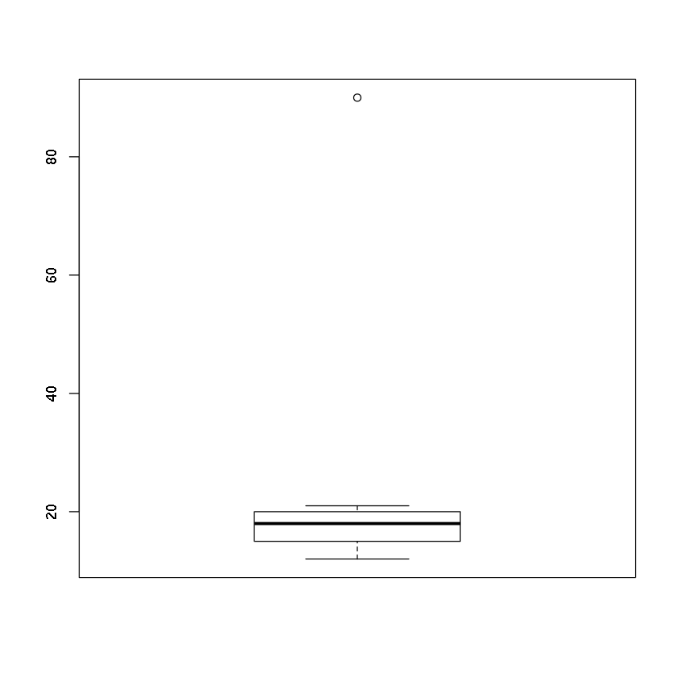

# Statistika Deskriptif

## `length()`,`min()`, `max()`, `sum()`, `prod()` dan `sort()`


```R
lagu <- c(5.3,3.6,5.5,4.7,6.7,4.3,6.2,4.3,4.9,5.1,5.8,4.4) 
lagu
```


<ol class=list-inline>
	<li>5.3</li>
	<li>3.6</li>
	<li>5.5</li>
	<li>4.7</li>
	<li>6.7</li>
	<li>4.3</li>
	<li>6.2</li>
	<li>4.3</li>
	<li>4.9</li>
	<li>5.1</li>
	<li>5.8</li>
	<li>4.4</li>
</ol>


```R
length(lagu) # banyaknya elemen
```


12


```R
max(lagu) # nilai terbesar
```


6.7


```R
min(lagu) # nilai terkecil
```


3.6


```R
sum(lagu) # total penjumlahan elemen di dalam vektor
```


60.8


```R
prod(lagu) # total perkalian elemen di dalam vektor
```


241595726.162817


```R
# mengurutkan vektor dari kecil ke besar
sort(lagu)
```


<ol class=list-inline>
	<li>3.6</li>
	<li>4.3</li>
	<li>4.3</li>
	<li>4.4</li>
	<li>4.7</li>
	<li>4.9</li>
	<li>5.1</li>
	<li>5.3</li>
	<li>5.5</li>
	<li>5.8</li>
	<li>6.2</li>
	<li>6.7</li>
</ol>


```R
# mengurutkan vektor dari besar ke kecil
sort(lagu, decreasing=T)
```


<ol class=list-inline>
	<li>6.7</li>
	<li>6.2</li>
	<li>5.8</li>
	<li>5.5</li>
	<li>5.3</li>
	<li>5.1</li>
	<li>4.9</li>
	<li>4.7</li>
	<li>4.4</li>
	<li>4.3</li>
	<li>4.3</li>
	<li>3.6</li>
</ol>


## Rata - rata

Jenis rata - rata:
* Rata - rata aritmatika (rata - rata)
* Rata - rata geometri
* Rata - rata harmonik

### Rata - rata aritmatika

Rata - rata aritmatika dari suatu sampel adalah penjumlahan dari seluruh sampel, dibagi dengan ukuran sampel.

$$\bar{x} = \frac{1}{n}\sum_{i=1}^{n}x_{i}$$


```R
lagu
```


<ol class=list-inline>
	<li>5.3</li>
	<li>3.6</li>
	<li>5.5</li>
	<li>4.7</li>
	<li>6.7</li>
	<li>4.3</li>
	<li>6.2</li>
	<li>4.3</li>
	<li>4.9</li>
	<li>5.1</li>
	<li>5.8</li>
	<li>4.4</li>
</ol>


```R
rata2 <- sum(lagu) / length(lagu)
rata2
```


5.06666666666667


```R
# pakai fungsi built-in 
rata2 <- mean(lagu)
rata2
```


5.06666666666667


### Rata - rata geometri

Rata - rata geometri didefinisikan sebagai akar ke-$n$ dari perkalian seluruh sampel.

$$RG = \sqrt[n]{\prod_{i=1}^{n}x_{i}}$$


```R
lagu
```


<ol class=list-inline>
	<li>5.3</li>
	<li>3.6</li>
	<li>5.5</li>
	<li>4.7</li>
	<li>6.7</li>
	<li>4.3</li>
	<li>6.2</li>
	<li>4.3</li>
	<li>4.9</li>
	<li>5.1</li>
	<li>5.8</li>
	<li>4.4</li>
</ol>


```R
rata2geom <- prod(lagu)^(1/length(lagu)) 
rata2geom
```


4.99563581610903


```R
# Cara yang lebih efisien:
rata2geom <- exp(mean(log(lagu)))
rata2geom
```


4.99563581610903


### Aplikasi rata - rata geometri

Umum digunakan di dunia bisnis, misalnya:
* Perhitungan laju pertumbuhan.
* Perhitungan pengembalian portofolio keamanan. 

Perhitungan *compounded annual growth rate*. Misalkan ada saham sebuah perusahaan dengan:
* Pertumbuhan sebesar 10 % pada tahun pertama (misalkan awalnya harga saham: $\$100$):
$$100 + 10 = 10$$
* Penurunan sebesar 20 % di tahun kedua:
$$100 - 20 = 80$$
* Pada tahun ketiga pertumbuhan sebesar 30%:
$$100 + 30 = 130$$

Laju pertumbuhan: $$\sqrt[3]{110 \times 80 \times 130} = 104,586$$

Karena dalam persen, maka:
104.586 - 100 = 4.58 % (laju pertumbuhannya)


```R
saham <- c(100 + 10, 100 - 20, 100 + 30)
rg <- exp(mean(log(saham)))
rg
```


104.58643063512


```R
rg - 100
```


4.58643063511965


### Rata - rata harmonik

Rata - rata harmonik merupakan kebalikan dari rata - rata terbalik dari sampel:

$$\frac{1}{H} = \frac{1}{n}\sum_{i=1}^{n}\frac{1}{x_{i}}\text{ dengan } x_{i} > 0$$


```R
rata2harm <- 1 / mean(1/lagu)
rata2harm
```


4.92500029031758


* Rata - rata harmonik digunakan untuk mencari hubungan perkalian atau pembagian antar pecahan.
* Rata - rata harmonik banyak digunakan untuk merata - ratakan suatu kelajuan.
* Di bidang finansial banyak digunakan untuk menghitung *price-earnings ratio*.

## Median dan modus

Median: nilai tengah suatu sampel yang telah diurutkan.
* Pada sampel ganjil:
$$x_{\frac{n + 1}{2}}$$
* Pada sampel genap:
$$\frac{x_{\frac{n}{2}} + x_{\frac{n}{2}+1}}{2}$$

Modus merupakan nilai yang paling sering muncul di dalam suatu sampel.
* Suatu sampel dapat mempunyai sebuah modus, lebih dari satu modus, atau tidak mempunyai modus sama sekali.
* Modus dapat mempunyai nilai yang sama dengan rata - rata dan median.


```R
sort(lagu)
```


<ol class=list-inline>
	<li>3.6</li>
	<li>4.3</li>
	<li>4.3</li>
	<li>4.4</li>
	<li>4.7</li>
	<li>4.9</li>
	<li>5.1</li>
	<li>5.3</li>
	<li>5.5</li>
	<li>5.8</li>
	<li>6.2</li>
	<li>6.7</li>
</ol>


```R
median(lagu) # cara menghitung median
```


5


R tidak mempunyai fungsi untuk menghitung modus karena modus jarang digunakan untuk analisis statistik

## Pencilan


```R
gaji <- c(12,14,18,90,16,19,21) # gaji bulanan dalam juta rupiah
gaji
```


<ol class=list-inline>
	<li>12</li>
	<li>14</li>
	<li>18</li>
	<li>90</li>
	<li>16</li>
	<li>19</li>
	<li>21</li>
</ol>


```R
mean(gaji)
```


27.1428571428571


```R
median(gaji)
```


18


Terdapat perbedaan yang sangat jauh antara rata - rata dan median.


```R
boxplot(gaji)
```





```R
mean(gaji, trim=0.1)
```


27.1428571428571


```R
mean(gaji, trim=0.5)
```


18


```R
mean(gaji, trim=0.2)
```


17.6


## Kuartil dan kuantil

Kuartil merupakan istilah statistik yang digunakan untuk mendeskripsikan pembagian selang data ke dalam empat interval.

* Kuartil memisahkan data ke dalam tiga titik, yakni kuartil bawah, median, dan kuartil atas.
* Kuartil digunakan untuk menghitung jangkauan antar kuartil (IQR = Q1 - Q3) guna menghitung variabilitas di sekitar median.
* Setiap kuartil memuat 25% dari total data.


Untuk mencari letak kuartil, gunakan persamaan:
$$Q_{i} = \frac{i(n+1)}{4}\text{ dengan } i = 1,2,3$$


```R
lagu
```


<ol class=list-inline>
	<li>5.3</li>
	<li>3.6</li>
	<li>5.5</li>
	<li>4.7</li>
	<li>6.7</li>
	<li>4.3</li>
	<li>6.2</li>
	<li>4.3</li>
	<li>4.9</li>
	<li>5.1</li>
	<li>5.8</li>
	<li>4.4</li>
</ol>


```R
mean(lagu)
```


5.06666666666667


```R
median(lagu)
```


5


```R
summary(lagu) # digunakan untuk mencari sari data (termasuk kuartil)
```


       Min. 1st Qu.  Median    Mean 3rd Qu.    Max. 
      3.600   4.375   5.000   5.067   5.575   6.700 


```R
# cara menghitung kuantil:
# sintaks: quantile(data, c(probabilitas1,probabilitas2))
quantile(lagu, c(.25, .75)) 
```


<dl class=dl-horizontal>
	<dt>25%</dt>
		<dd>4.375</dd>
	<dt>75%</dt>
		<dd>5.575</dd>
</dl>


## Varian dan standar deviasi

Digunakan untuk mengukur variabilitas dari suatu data atau akurasi dari parameter - parameter statistik.

* Varian: merupakan ukuran sebaran antar elemen di dalam sampel.
* Standar deviasi: merupakan akar kuadrat dari varian.

$$s^2 = \frac{\sum_{i=1}^{n} (\bar{x} - x_{i} )^{2}}{n-1}$$


```R
lagu
```


<ol class=list-inline>
	<li>5.3</li>
	<li>3.6</li>
	<li>5.5</li>
	<li>4.7</li>
	<li>6.7</li>
	<li>4.3</li>
	<li>6.2</li>
	<li>4.3</li>
	<li>4.9</li>
	<li>5.1</li>
	<li>5.8</li>
	<li>4.4</li>
</ol>


```R
var(lagu) # varian
```


0.787878787878788


```R
sd(lagu) # std
```


0.887625364598595


## Varian dan standar deviasi pada harga saham


```R
library(dplyr)
```

    
    Attaching package: ‘dplyr’
    
    The following objects are masked from ‘package:stats’:
    
        filter, lag
    
    The following objects are masked from ‘package:base’:
    
        intersect, setdiff, setequal, union
    


```R
gedata <- read.csv("../data/GEStock.csv")
geprice <- select(gedata,Price)
```


```R
ibmdata <- read.csv("../data/IBMStock.csv")
ibmprice <- select(ibmdata, Price)
```


```R
var(geprice)
```


<table>
<thead><tr><th></th><th scope=col>Price</th></tr></thead>
<tbody>
	<tr><th scope=row>Price</th><td>575.6425</td></tr>
</tbody>
</table>


```R
var(ibmprice) # lebih volatil ketimbang general electrics
```


<table>
<thead><tr><th></th><th scope=col>Price</th></tr></thead>
<tbody>
	<tr><th scope=row>Price</th><td>7712.717</td></tr>
</tbody>
</table>


```R
sd(as.vector(geprice$Price))
```


23.992551305301


```R
sd(as.vector(ibmprice$Price))
```


87.822078211186


## Korelasi dan kovarian

* Korelasi merupakan metode statistik yang digunakan untuk mengukur derajat relasi antar dua variabel.
* Di dalam dunia finansial, korelasi dapat mengukur pergerakan harga saham. 

Korelasi:
$$r = \frac{\sum (x-\bar{x}) (y-\bar{y})}{\sqrt{\sum (x-\bar{x})^{2}} \sqrt{(y-\bar{y})^{2}}}$$

Hasil korelai selalu berada di antara -1 hingga +1

* Korelasi positif menunjukkan bahwa tren kedua data berada pada arah yang sama.
* Korelasi negatif menunjukkan bahwa tren kedua data berada pada arah yang berbeda.
* Korelasi nol menunjukkan bahwa tidak ada hubungan antar tren kedua data.


```R
x <- seq(10,50, by=10)
y <- x
```


```R
cor(x,y) # karena data sama maka r = 1
```


1


```R
y <- c(50,40,30,20,10)
```


```R
cor(x,y) # terbalik r = -1
```


-1


```R
x <- c(41,19,23,40,55)
y <- c(94,60,74,71,82)
cor(x,y)
```


0.64810840039477


```R
gedates <- select(gedata, Date)
geprice <- select(gedata, Price)
ibmdates <- select(ibmdata, Date)
ibmprice <- select(ibmdata, Price)
```


```R
cor(geprice,ibmprice) # secara default menggunakan korelasi pearson
```


<table>
<thead><tr><th></th><th scope=col>Price</th></tr></thead>
<tbody>
	<tr><th scope=row>Price</th><td>0.1098373</td></tr>
</tbody>
</table>


```R
cor(geprice,ibmprice, use='complete.obs') # guna menangani nilai NaN
```


<table>
<thead><tr><th></th><th scope=col>Price</th></tr></thead>
<tbody>
	<tr><th scope=row>Price</th><td>0.1098373</td></tr>
</tbody>
</table>


```R
cor(geprice, ibmprice, method = 'spearman') # korelasi spearman
```


<table>
<thead><tr><th></th><th scope=col>Price</th></tr></thead>
<tbody>
	<tr><th scope=row>Price</th><td>0.1665118</td></tr>
</tbody>
</table>


```R
geprice_vec <- as.vector(geprice$Price)
ibmprice_vec <- as.vector(ibmprice$Price)
```


```R
cor.test(geprice_vec,ibmprice_vec, method='pearson')
```


    
    	Pearson's product-moment correlation
    
    data:  geprice_vec and ibmprice_vec
    t = 2.416, df = 478, p-value = 0.01607
    alternative hypothesis: true correlation is not equal to 0
    95 percent confidence interval:
     0.02053871 0.19739721
    sample estimates:
          cor 
    0.1098373 


```R
cor.test(geprice_vec,ibmprice_vec, method='spearman')
```


    
    	Spearman's rank correlation rho
    
    data:  geprice_vec and ibmprice_vec
    S = 15362788, p-value = 0.0002528
    alternative hypothesis: true rho is not equal to 0
    sample estimates:
          rho 
    0.1665118 


```R
cor.test(geprice_vec,ibmprice_vec, method='kendall')
```


    
    	Kendall's rank correlation tau
    
    data:  geprice_vec and ibmprice_vec
    z = 3.9796, p-value = 6.902e-05
    alternative hypothesis: true tau is not equal to 0
    sample estimates:
          tau 
    0.1215379 


* Kovarian merupakan metode statistik yang digunakan untuk mengukur hubungan langsung antara kedua variabel.
* Ketika dua harga saham mempunyai perbedaan varian yang besar, maka kovariannya positif, pun begitu sebaliknya (kebalikan dari korelasi).
* Banyak digunakan pada teori potofolio modern di bidang finansial.


```R
cov(geprice, ibmprice)
```


<table>
<thead><tr><th></th><th scope=col>Price</th></tr></thead>
<tbody>
	<tr><th scope=row>Price</th><td>231.4354</td></tr>
</tbody>
</table>


## Contoh kasus perbandingan harga saham


```R
cor(geprice,ibmprice)
```


<table>
<thead><tr><th></th><th scope=col>Price</th></tr></thead>
<tbody>
	<tr><th scope=row>Price</th><td>0.1098373</td></tr>
</tbody>
</table>


```R
cov(geprice,ibmprice)
```


<table>
<thead><tr><th></th><th scope=col>Price</th></tr></thead>
<tbody>
	<tr><th scope=row>Price</th><td>231.4354</td></tr>
</tbody>
</table>


```R
# mengimpor data saham cocacola
cocadata <- read.csv("../data/CocaColaStock.csv")
cocadates <- select(cocadata, Date)
cocaprice <- select(cocadata, Price)
```


```R
cor(geprice, cocaprice)
```


<table>
<thead><tr><th></th><th scope=col>Price</th></tr></thead>
<tbody>
	<tr><th scope=row>Price</th><td>0.1775435</td></tr>
</tbody>
</table>


```R
cov(geprice, cocaprice)
```


<table>
<thead><tr><th></th><th scope=col>Price</th></tr></thead>
<tbody>
	<tr><th scope=row>Price</th><td>107.2014</td></tr>
</tbody>
</table>


Dapat dikatakan harga saham di GE dan CocaCola secara komparatif lebih terhubung daripada GE dengan IBM. 
