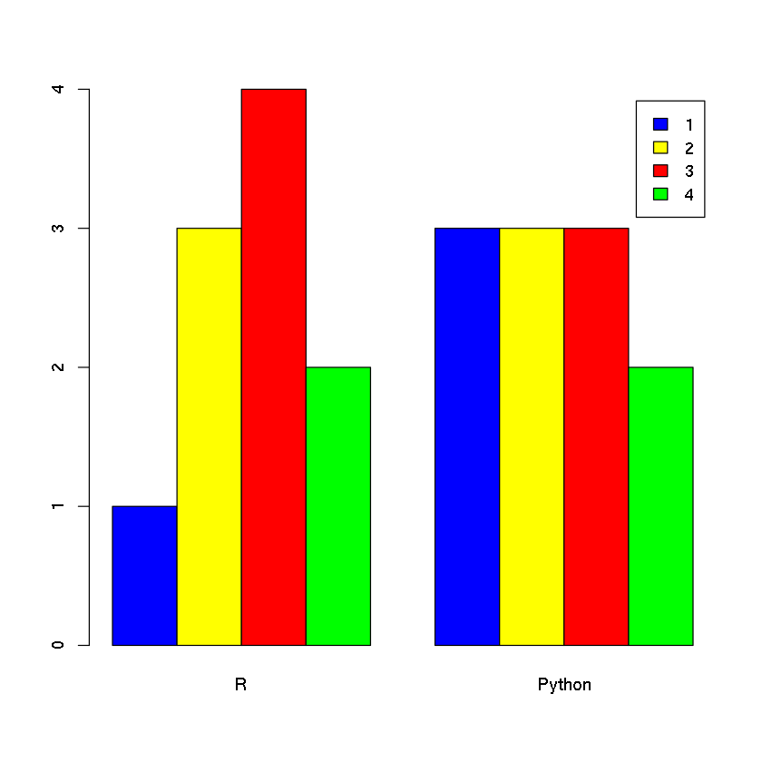
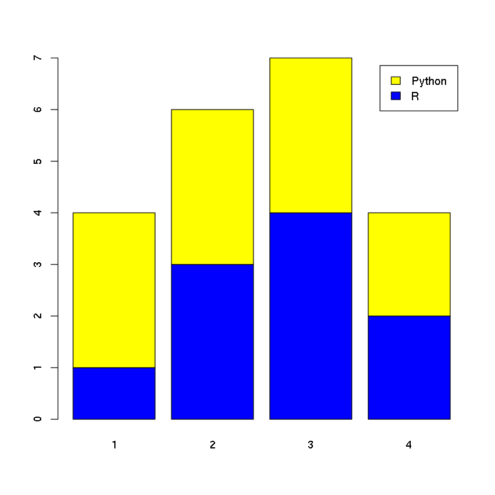
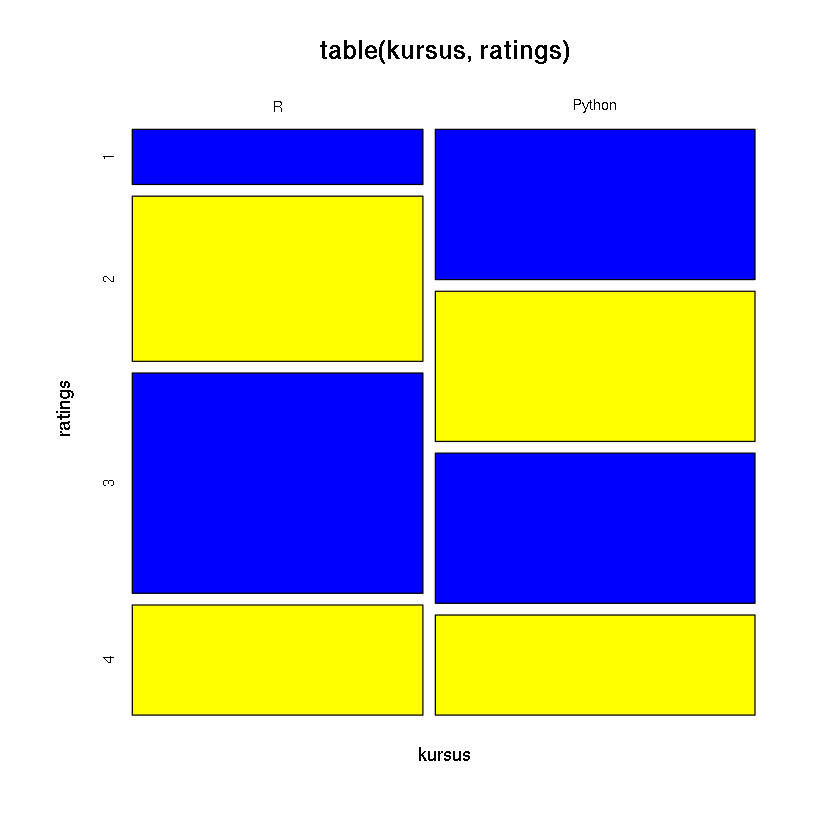
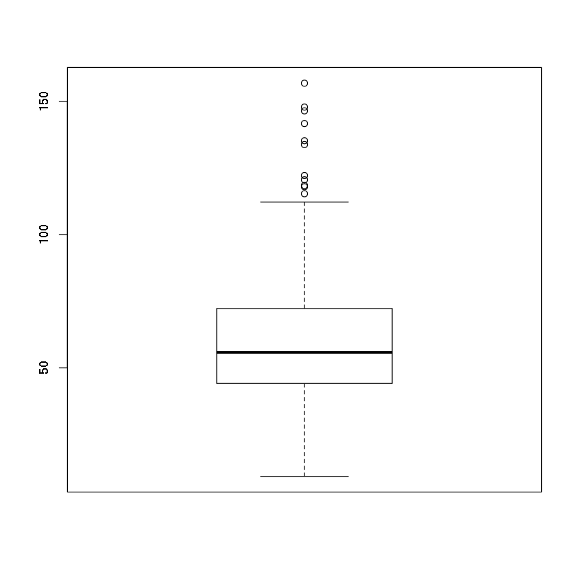
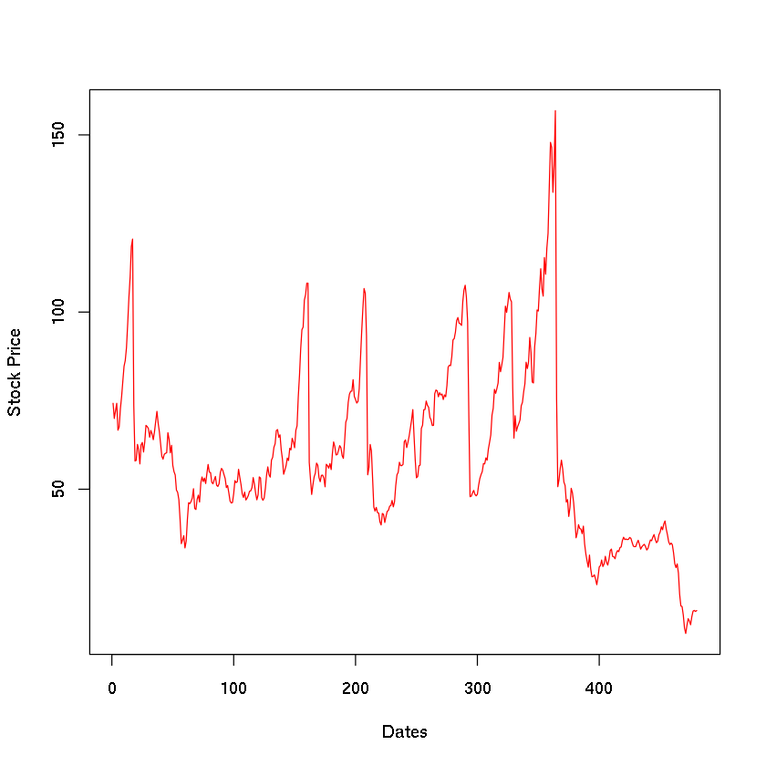
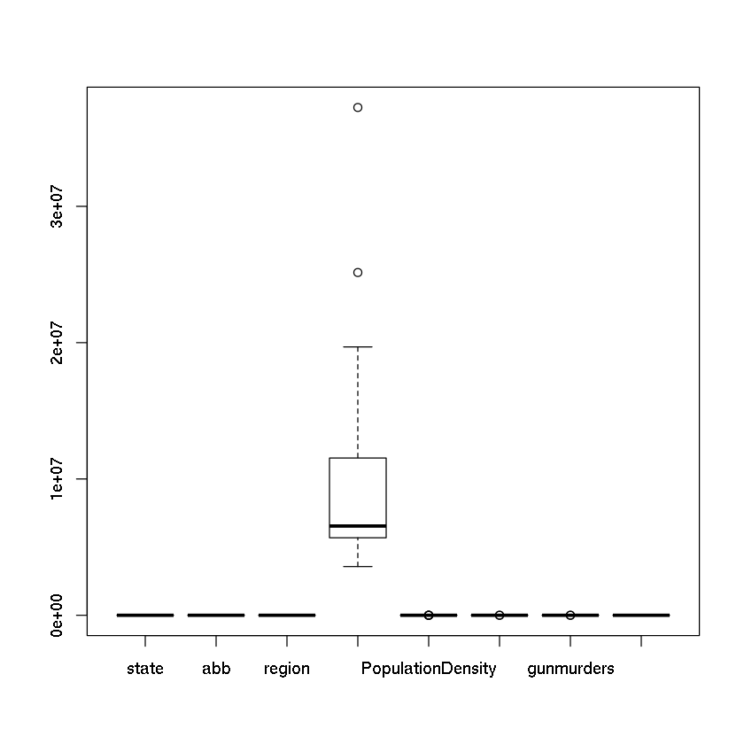
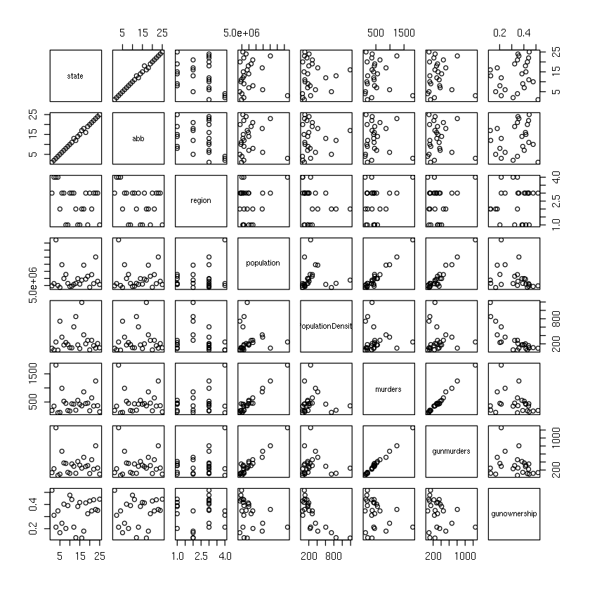
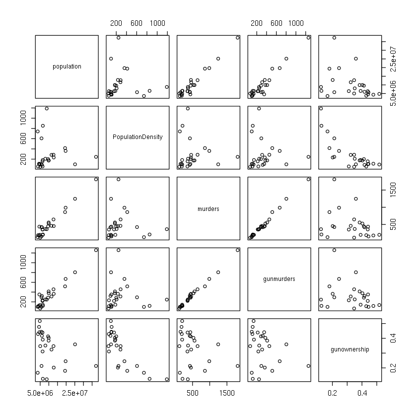
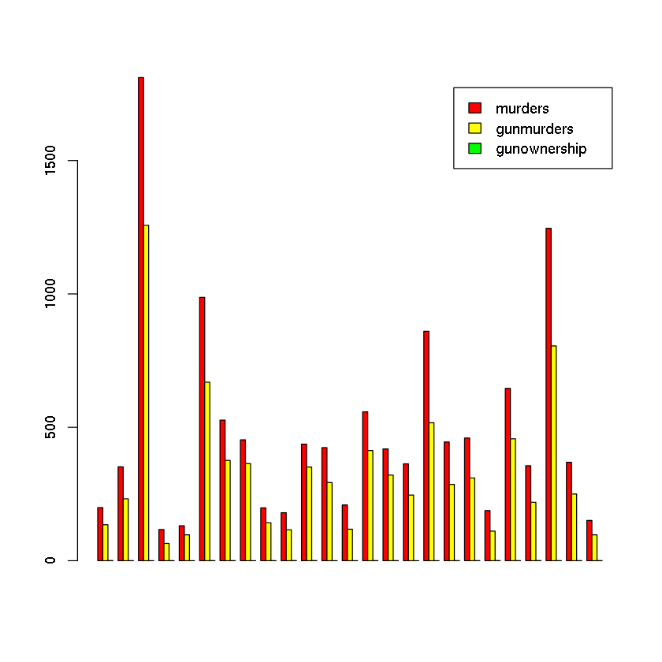

# Analisis data bivariat dan multivariat

## Data bivariat 

Data bivariat mendeskripsikan hubungan antar dua buah variabel. Misalnya:
* Hubungan antara berat dan tinggi badan.
* Hubungan antara risiko penyakit jantung dengan jenis kelamin.
*  dll.

Data bivariat, terdiri dari:
* 2 variabel kualitatif
* 1 variabel kualitatif dan 1 variabel kuantitatif.
* 2 variabel kuantitatif.

### Data bivariat kualitatif


```R
ratings <- factor(c(2,4,3,3,2,1,1,2,3,4,2,3,3,4,1,3,2,4,3,2,1))
ratings 
```


<ol class=list-inline>
	<li>2</li>
	<li>4</li>
	<li>3</li>
	<li>3</li>
	<li>2</li>
	<li>1</li>
	<li>1</li>
	<li>2</li>
	<li>3</li>
	<li>4</li>
	<li>2</li>
	<li>3</li>
	<li>3</li>
	<li>4</li>
	<li>1</li>
	<li>3</li>
	<li>2</li>
	<li>4</li>
	<li>3</li>
	<li>2</li>
	<li>1</li>
</ol>

<details>
	<summary style=display:list-item;cursor:pointer>
		<strong>Levels</strong>:
	</summary>
	<ol class=list-inline>
		<li>'1'</li>
		<li>'2'</li>
		<li>'3'</li>
		<li>'4'</li>
	</ol>
</details>


```R
kursus <- factor(c(1,1,0,0,1,1,0,0,1,0,0,0,1,0,1,0,1,1,1,0,1))
kursus
```


<ol class=list-inline>
	<li>1</li>
	<li>1</li>
	<li>0</li>
	<li>0</li>
	<li>1</li>
	<li>1</li>
	<li>0</li>
	<li>0</li>
	<li>1</li>
	<li>0</li>
	<li>0</li>
	<li>0</li>
	<li>1</li>
	<li>0</li>
	<li>1</li>
	<li>0</li>
	<li>1</li>
	<li>1</li>
	<li>1</li>
	<li>0</li>
	<li>1</li>
</ol>

<details>
	<summary style=display:list-item;cursor:pointer>
		<strong>Levels</strong>:
	</summary>
	<ol class=list-inline>
		<li>'0'</li>
		<li>'1'</li>
	</ol>
</details>


```R
levels(kursus) <- c('R', 'Python')
```


```R
table(ratings, kursus)
```


           kursus
    ratings R Python
          1 1      3
          2 3      3
          3 4      3
          4 2      2


```R
table(kursus, ratings)
```


            ratings
    kursus   1 2 3 4
      R      1 3 4 2
      Python 3 3 3 2


```R
barplot(table(ratings, kursus),
       col=c('blue', 'yellow', 'red', 'green'), legend=T, beside=T)
```





```R
barplot(table(kursus, ratings),
       col=c('blue', 'yellow', 'red', 'green'),
       legend.text=T)
```





```R
mosaicplot(table(kursus,ratings),
          col=c('blue', 'yellow'))
```





### Data bivariat kuantitatif


```R
library(dplyr)
df <- read.csv("../data/GEStock.csv")
dates <- select(df, Date)
price <- select(df, Price)
```


```R
boxplot(price) # hanya untuk univariat
```





```R
plot(df$Price,
    xlab='Dates',
    ylab='Stock Price',
    col='red',
    type='l')
```





```R
max(df$Price)
```


156.8436842


```R
which(df$Price == max(df$Price)) # indeks maksimum
```


364


```R
df[which(df$Price == max(df$Price)),]
```


<table>
<thead><tr><th></th><th scope=col>Date</th><th scope=col>Price</th></tr></thead>
<tbody>
	<tr><th scope=row>364</th><td>4/1/00  </td><td>156.8437</td></tr>
</tbody>
</table>


## Data multivariat


```R
df <- read.csv("../data/murders.csv")
head(df)
```


<table>
<thead><tr><th scope=col>state</th><th scope=col>abb</th><th scope=col>region</th><th scope=col>population</th><th scope=col>PopulationDensity</th><th scope=col>murders</th><th scope=col>gunmurders</th><th scope=col>gunownership</th></tr></thead>
<tbody>
	<tr><td>Alabama    </td><td>AL         </td><td>South      </td><td> 4779736   </td><td> 94.65     </td><td> 199       </td><td> 135       </td><td>0.517      </td></tr>
	<tr><td>Arizona    </td><td>AZ         </td><td>West       </td><td> 6392017   </td><td> 57.05     </td><td> 352       </td><td> 232       </td><td>0.311      </td></tr>
	<tr><td>California </td><td>CA         </td><td>West       </td><td>37253956   </td><td>244.20     </td><td>1811       </td><td>1257       </td><td>0.213      </td></tr>
	<tr><td>Colorado   </td><td>CO         </td><td>West       </td><td> 5029196   </td><td> 49.33     </td><td> 117       </td><td>  65       </td><td>0.347      </td></tr>
	<tr><td>Connecticut</td><td>CT         </td><td>Northeast  </td><td> 3574097   </td><td>741.40     </td><td> 131       </td><td>  97       </td><td>0.167      </td></tr>
	<tr><td>Florida    </td><td>FL         </td><td>South      </td><td>19687653   </td><td>360.20     </td><td> 987       </td><td> 669       </td><td>0.245      </td></tr>
</tbody>
</table>


```R
str(df)
```

    'data.frame':	25 obs. of  8 variables:
     $ state            : Factor w/ 25 levels "Alabama","Arizona",..: 1 2 3 4 5 6 7 8 9 10 ...
     $ abb              : Factor w/ 25 levels "AL","AZ","CA",..: 1 2 3 4 5 6 7 8 9 10 ...
     $ region           : Factor w/ 4 levels "North Central",..: 3 4 4 4 2 3 3 1 1 3 ...
     $ population       : int  4779736 6392017 37253956 5029196 3574097 19687653 9920000 12830632 6483802 4339367 ...
     $ PopulationDensity: num  94.7 57 244.2 49.3 741.4 ...
     $ murders          : int  199 352 1811 117 131 987 527 453 198 180 ...
     $ gunmurders       : int  135 232 1257 65 97 669 376 364 142 116 ...
     $ gunownership     : num  0.517 0.311 0.213 0.347 0.167 0.245 0.403 0.202 0.391 0.477 ...


```R
summary(df)
```


             state         abb               region     population      
     Alabama    : 1   AL     : 1   North Central: 6   Min.   : 3574097  
     Arizona    : 1   AZ     : 1   Northeast    : 5   1st Qu.: 5686986  
     California : 1   CA     : 1   South        :11   Median : 6547629  
     Colorado   : 1   CO     : 1   West         : 3   Mean   :10155719  
     Connecticut: 1   CT     : 1                      3rd Qu.:11536504  
     Florida    : 1   FL     : 1                      Max.   :37253956  
     (Other)    :19   (Other):19                                        
     PopulationDensity    murders         gunmurders      gunownership   
     Min.   :  49.33   Min.   : 117.0   Min.   :  65.0   Min.   :0.1230  
     1st Qu.: 105.00   1st Qu.: 199.0   1st Qu.: 135.0   1st Qu.:0.2130  
     Median : 182.50   Median : 419.0   Median : 286.0   Median :0.3510  
     Mean   : 282.57   Mean   : 483.4   Mean   : 329.9   Mean   :0.3305  
     3rd Qu.: 285.30   3rd Qu.: 527.0   3rd Qu.: 376.0   3rd Qu.:0.4170  
     Max.   :1189.00   Max.   :1811.0   Max.   :1257.0   Max.   :0.5170  
                                                                         


```R
boxplot(df)
```





```R
plot(df)
```





```R
pairs(df[,-c(1,2,3)]) # tidak memasukan kolom no 1,2,3
```





```R
dfsel <- df[,-c(1,2,3,4,5)] # hanya memasukan data kuantitatif
```


```R
mat <- data.matrix(dfsel) # konversi data terseleksi ke matriks
mat <- t(mat)
```


```R
barplot(mat,
       col=c('red', 'yellow',
            'green'),
       beside=T,
       names.arg=dfsel$state,
       legend.text=T)
```




