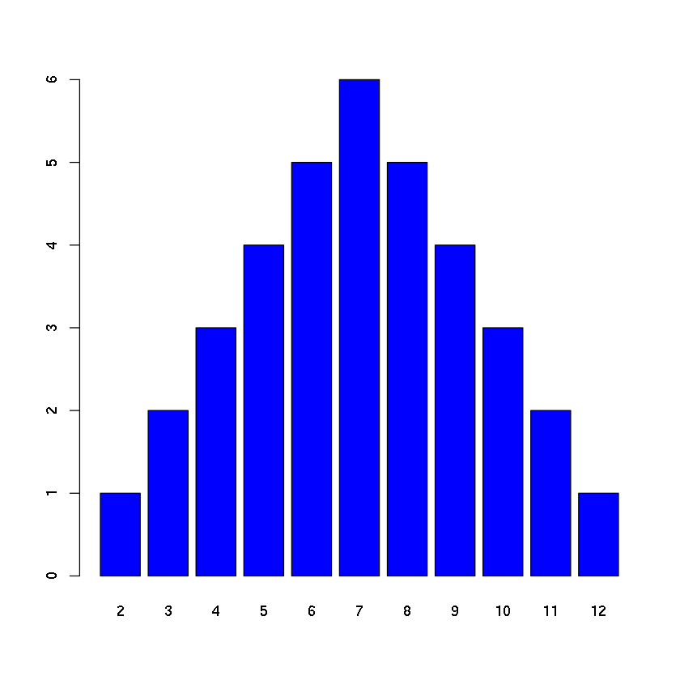
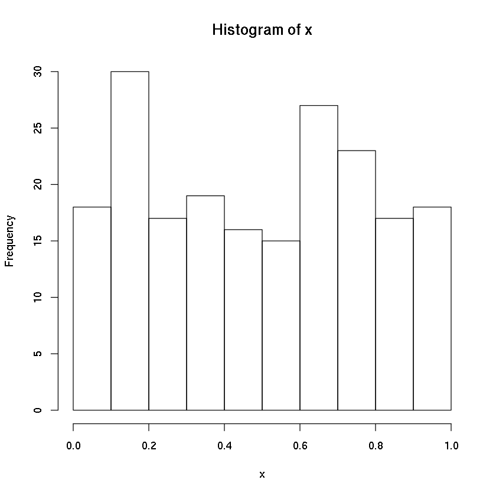
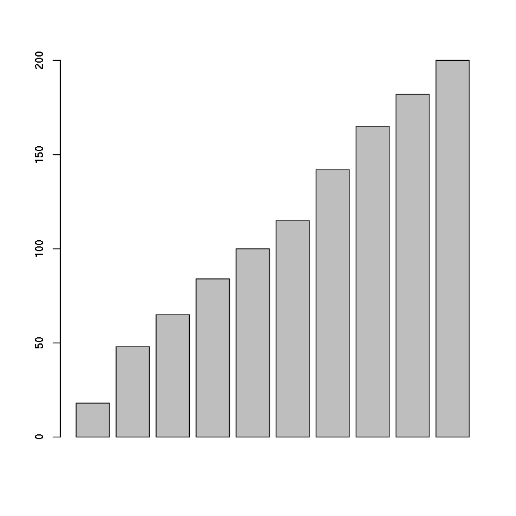
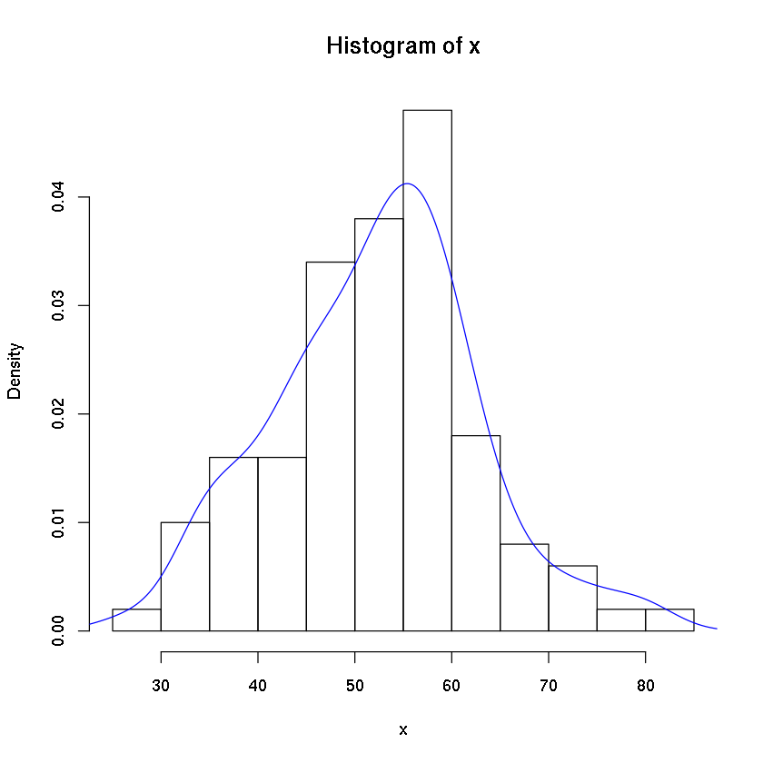

# Distribusi peluang

## Pendahuluan

Distribusi peluang merupakan fungsi statistik yang digunakan untuk mendeskripsikan seluruh kemungkinan nilai dari suatu variabel acak. 

Distribusi peluang bergantung pada:
* Rata - rata
* Standar deviasi
* Kemencengan

Jenis - jenis:
* Distribusi normal
* Distribusi seragam
* Distribusi chi-kuadrat
* Distribusi binomial
* Distribusi Poisson


```R
# Contoh pelemparan dua buah dadu

totaldadu <- c(2,3,4,5,6,7,8,9,10,11,12)
posibilitas <- c(1,2,3,4,5,6,5,4,3,2,1)
barplot(posibilitas,
       col='blue',
       names.arg=totaldadu)
```





```R
# distribusi acak seragam (0-1)
runif(5)
```


<ol class=list-inline>
	<li>0.123731347266585</li>
	<li>0.60765249398537</li>
	<li>0.533600943861529</li>
	<li>0.681078718043864</li>
	<li>0.986109193181619</li>
</ol>


```R
runif(5,1,6) # (1-6)
```


<ol class=list-inline>
	<li>4.62048985203728</li>
	<li>3.29562402702868</li>
	<li>1.28878939570859</li>
	<li>2.99522116803564</li>
	<li>1.37944304407574</li>
</ol>


```R
as.integer(runif(5,1,6)) # simulasi lempar dadu 5x
```


<ol class=list-inline>
	<li>1</li>
	<li>1</li>
	<li>1</li>
	<li>1</li>
	<li>4</li>
</ol>


## Distribusi seragam

Distribusi seragam adalah distribusi peluang dengan peluang kemunculan nilai yang sama di antara setiap kemungkinannya. Contoh:
* Pelemparan koin.
* Kartu di dalam dek.
<br><br>
Terdapat dua jenis distribusi seragam:
* Diskrit
* Kontinyu


```R
runif(10)
```


<ol class=list-inline>
	<li>0.569517947733402</li>
	<li>0.27695785346441</li>
	<li>0.0101017325650901</li>
	<li>0.216280498541892</li>
	<li>0.926169243408367</li>
	<li>0.289980907225981</li>
	<li>0.590355885447934</li>
	<li>0.356919593410566</li>
	<li>0.0631376963574439</li>
	<li>0.385881984839216</li>
</ol>


```R
x <- runif(200)
plot(x)
```


```R
hist(x)
```





```R
h <- hist(x,plot=F)
h
```


    $breaks
     [1] 0.0 0.1 0.2 0.3 0.4 0.5 0.6 0.7 0.8 0.9 1.0
    
    $counts
     [1] 18 30 17 19 16 15 27 23 17 18
    
    $density
     [1] 0.90 1.50 0.85 0.95 0.80 0.75 1.35 1.15 0.85 0.90
    
    $mids
     [1] 0.05 0.15 0.25 0.35 0.45 0.55 0.65 0.75 0.85 0.95
    
    $xname
    [1] "x"
    
    $equidist
    [1] TRUE
    
    attr(,"class")
    [1] "histogram"


```R
hcum <- cumsum(h$counts)
```


```R
barplot(hcum) # distribusi kumulatif
```





## Distribusi normal

Merupakan distribusi peluang yang simetris terhadap rata - ratanya.


```R
x <- rnorm(100, 50, 10) # 100 bilangan acak dlm distribusi normal (rata2 = 50, sd = 10)
```


```R
hist(x, probability = T)
lines(density(x), col='blue')
```





```R
mean(x)
```


52.2726391744786


```R
sd(x)
```


10.3870913897489

